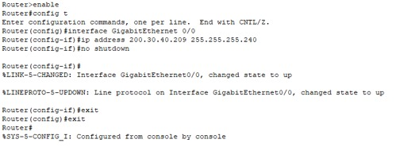
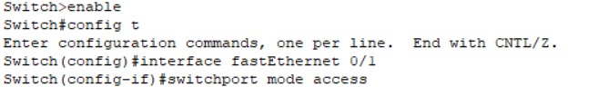
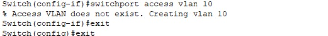

## Configuración de Red en Cisco Packet Tracer

### 1. Descripción del Proyecto
En este proyecto se configuró una red utilizando Cisco Packet Tracer con la dirección IP base `200.30.40.0/24`. Se realizó un subnetting para obtener 16 subredes con una máscara `/28` (`255.255.255.240`), proporcionando 14 hosts utilizables por subred. Se configuraron los routers y switches, y se creó una VLAN 10 para segmentar la red y mejorar la eficiencia en el tráfico.

---

### 2. Detalles del Subnetting y Distribución de Direcciones IP
La red `200.30.40.0/24` fue subdividida en 16 subredes, con un rango de 14 hosts utilizables por subred. 

| Subred            | Rango de Hosts Utilizables      |
|------------------|--------------------------------|
| `200.30.40.0/28`   | `200.30.40.1 - 200.30.40.14`   |
| `200.30.40.16/28`  | `200.30.40.17 - 200.30.40.30`  |
| `200.30.40.32/28`  | `200.30.40.33 - 200.30.40.46`  |
| `200.30.40.48/28`  | `200.30.40.49 - 200.30.40.62`  |
| `200.30.40.64/28`  | `200.30.40.65 - 200.30.40.78`  |
| `200.30.40.80/28`  | `200.30.40.81 - 200.30.40.94`  |
| `200.30.40.96/28`  | `200.30.40.97 - 200.30.40.110` |
| `200.30.40.112/28` | `200.30.40.113 - 200.30.40.126` |
| `200.30.40.128/28` | `200.30.40.129 - 200.30.40.142` |
| `200.30.40.144/28` | `200.30.40.145 - 200.30.40.158` |
| `200.30.40.160/28` | `200.30.40.161 - 200.30.40.174` |
| `200.30.40.176/28` | `200.30.40.177 - 200.30.40.190` |
| `200.30.40.192/28` | `200.30.40.193 - 200.30.40.206` |
| `200.30.40.208/28` | `200.30.40.209 - 200.30.40.222` |
| `200.30.40.224/28` | `200.30.40.225 - 200.30.40.238` |
| `200.30.40.240/28` | `200.30.40.241 - 200.30.40.254` |

Las demás subredes se generaron de la misma manera, utilizando incrementos de 16 direcciones (debido a la máscara `/28`).

---

### 3. Configuración de Routers
A continuación, se muestra un ejemplo de la configuración de un router. Las demás configuraciones de routers se realizarán de la misma forma, ajustando las direcciones IP según corresponda a las subredes asignadas.

#### **Ejemplo de Configuración de Router 1 (R1)**

**Acceder al modo de configuración:**

```bash
enable
config t
```

**Configuración de las interfaces:**

```bash
interface gigabitEthernet 0/0
ip address 200.30.40.209 255.255.255.240
no shutdown
exit

interface gigabitEthernet 0/1
ip address 200.30.40.1 255.255.255.240
no shutdown
exit
```


**Guardar la configuración:**

```bash
write memory
```

La configuración de las demás interfaces en los routers se realiza de manera similar, cambiando las direcciones IP de acuerdo con las subredes asignadas a cada router.

---

### 4. Configuración de Switch y Creación de VLAN 10
En cuanto a los switches, se configuró uno para VLAN 10. A continuación, un ejemplo de la configuración de un puerto en el switch. Las demás configuraciones se seguirán de la misma forma.

**Acceder al modo de configuración:**

```bash
enable
config t
```

**Configuración de un puerto en modo acceso y asignación a VLAN 10:**

```bash
interface fastEthernet 0/1
switchport mode access
switchport access vlan 10
exit
```


**Nota:** Si la VLAN 10 no existía, se creó automáticamente.

**Guardar la configuración:**

```bash
write memory
```


---

### 5. Conclusiones
La configuración de la red fue exitosa, cumpliendo los siguientes objetivos:

- Subnetting de la red base en 16 subredes.
- Configuración de routers y asignación de IPs en sus interfaces.
- Creación de la VLAN 10 y configuración de los switches.
- La configuración de las demás interfaces de los routers y de los switches se realiza de manera similar al ejemplo presentado.
